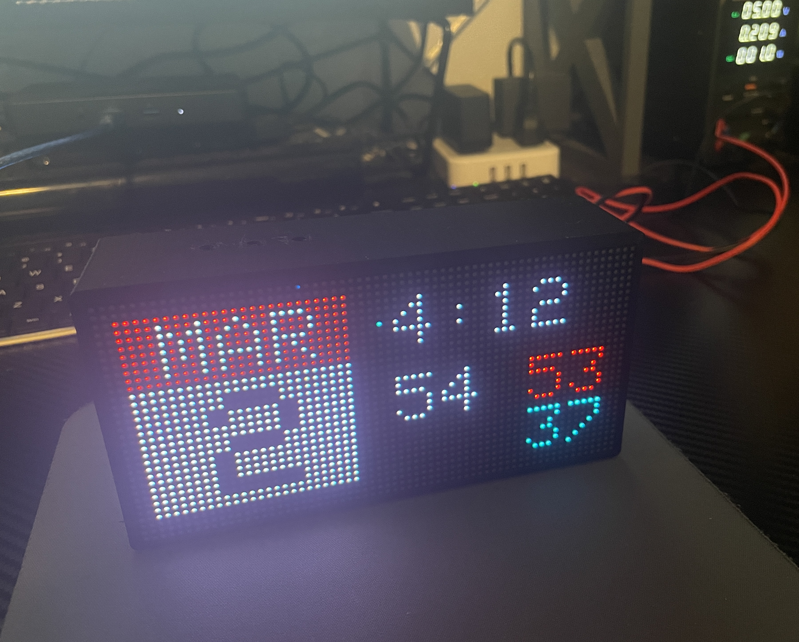
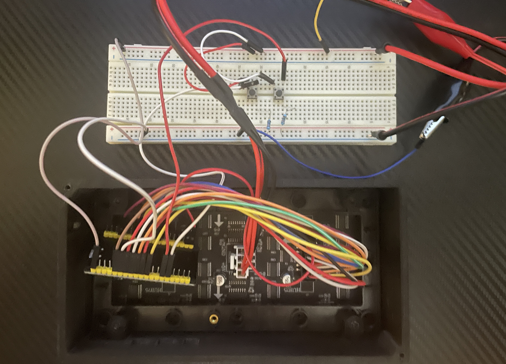
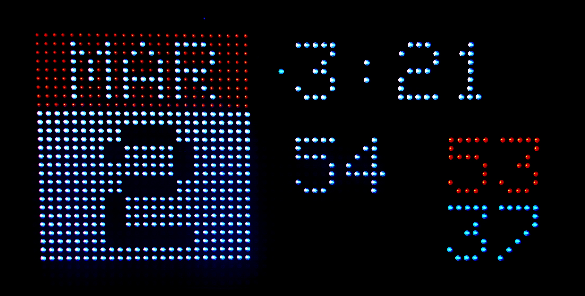
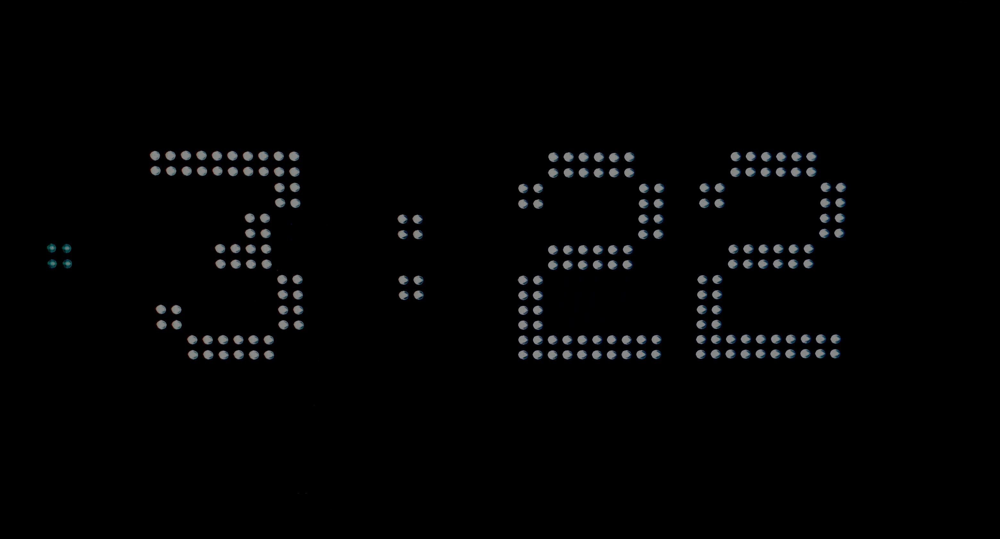

# DotClock Project

## Overview

The DotClock project is a work in progress for a customizable clock display built using ESP32 microcontroller and HUB75 LED matrix panels. 
It provides various features such as displaying time, date, and weather information in real-time. This README file serves as a guide to set up and use the DotClock project.

## Features

- Real-time clock synchronization via internet time servers
- Display of current time and date
- Weather information display
- Customizable display modes (more to be added)
- Brightness control and mode selection via physical buttons

## Installation

To install the DotClock project, follow these steps:

1. Clone or download the project repository from GitHub.
2. Open the project in your preferred Integrated Development Environment (IDE) such as PlatformIO or Arduino IDE.
3. Upload the code to your ESP32 microcontroller board.
4. Connect the LED matrix panels to the ESP32 board according to the wiring instructions provided in the project documentation. (under development)

## Usage

After installation, follow these steps to use the DotClock project:

1. Power on the ESP32 microcontroller board.
2. The clock display will initialize and show the current time.
3. Use the physical buttons (brightness and mode) to adjust the display brightness and switch between different modes (digital clock, date view, etc.).
4. The clock will automatically synchronize with internet time servers to ensure accurate timekeeping.

## Work in Progress

This project is currently a work in progress. While it is functional, there may be ongoing development and improvements. Please feel free to contribute by submitting bug reports, feature requests, or pull requests.

If you encounter any issues or have suggestions for improvements, please open an issue on the [Issue Tracker](https://github.com/KushDIY/DotClock/issues).

Your feedback is valuable and will help make this project better for everyone!

Current Wiring

## Current Screens

Date/Time/Weather View

Digital Clock View

## License

This project is licensed under the [GNU General Public License v3.0](LICENSE) - see the [LICENSE](LICENSE) file for details.

© 2024 KushDIY. All rights reserved.

